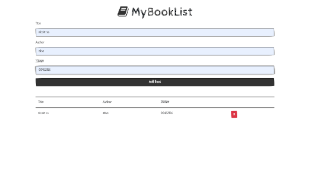

# booklist-app
## Table of contents
* [General info](#general-info)
* [Screenshots](#screenshots)
* [Technologies](#technologies)
* [Setup](#setup)
* [Features](#features)
* [Status](#status)
* [Inspiration](#inspiration)
* [Contact](#contact)

## General info
Code-Along exercise for practicing JavaScript, HTML, CSS.

## Screenshots

bookList.png

## Technologies
* JavaScript
* HTML
* `bootswatch ` and `font-awesome`
* GIT

## Setup
Fork, or clone this repository

## Features
List of features ready:
* Add a book to the list.
* Add delete to the list.
* Store a book in the local storage.
* font-awesome icon library.
* bootswatch theme for the layout.

## Status
Project is: _finished, final version_

## Inspiration
[`booklist-app`](https://elisa0045.github.io/booklist-app/) tutorial from [Traversy Media](https://www.youtube.com/watch?v=JaMCxVWtW58).

## Contact
Created by [@Elisa0045](https://github.com/Elisa0045) - feel free to contact me!